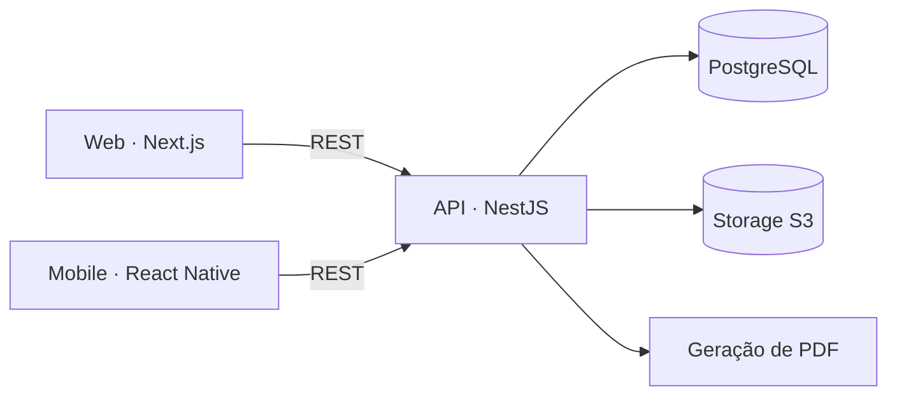

<div align="center"> 🛠 Projeto em construção 🛠 </div>

# 🏥 Clínica Vet: plataforma de gestão para clínicas veterinárias

Sistema completo para clínicas veterinárias: site institucional, área do cliente para tutores e painel administrativo para a equipe. Cobre cadastro de tutores e pets, agendamento de serviços, prontuário, vacinas, exames e emissão da carteira de vacinação em PDF, com web, API e aplicativo mobile.

# 📑 Sumário

1. [Funcionalidades](#funcionalidades)
2. [Status do projeto](#status)
3. [Arquitetura](#arquitetura)
4. [Tecnologias](#tecnologias)
5. [Perfis de acesso](#perfis)
6. [Instalação e execução](#instalacao)
7. [Testes](#testes)
8. [Estrutura do projeto](#estrutura)
9. [Autor](#autor)

<h1 id="funcionalidades">✨ Funcionalidades</h1>

- **Site institucional** com informações da clínica, serviços, horários e contato
- **Cadastro e autenticação** de tutores, com ativação da conta por e-mail
- **Pets**: um ou vários por tutor, cada um com um código público único e automático
- **Agendamentos** de consulta, banho, tosa, vacinação e outros serviços configuráveis, com controle de conflitos de horário
- **Profissionais**: horários de trabalho e bloqueios de agenda
- **Prontuário**: consultas, histórico de peso, alergias e condições clínicas
- **Vacinas, medicamentos e exames**, com upload de anexos
- **Carteira de vacinação** na área do cliente e em PDF
- **Painel administrativo** com gestão de clientes, usuários e profissionais
- **Permissões por perfil** e trilha de auditoria
- **Aplicativo mobile** para o tutor acompanhar pets, agendamentos e vacinas

<h1 id="status">🚦 Status do projeto</h1>

| Módulo | Status |
|---|---|
| Monorepo, tipos compartilhados e mocks da API | ✅ Pronto |
| Login, cadastro e ativação de conta | ✅ Pronto (web, com API simulada) |
| Painel admin: clientes, usuários e profissionais | ✅ Pronto (web, com API simulada) |
| Controle de acesso por perfil | ✅ Pronto |
| Pets, agenda e prontuário | 🚧 Em desenvolvimento |
| API em NestJS | 📋 Planejado |
| Aplicativo mobile | 📋 Planejado |
| Carteira de vacinação em PDF | 📋 Planejado |
| Testes automatizados (Jest) | 📋 Planejado |
| Notificações por WhatsApp | 📋 Planejado (fase 2) |

<h1 id="arquitetura">🏗 Arquitetura</h1>



- **Monorepo com pnpm workspaces**: web, API e mobile compartilham os mesmos tipos (`packages/shared-types`), então o contrato da API é único para todos.
- **Frontend desacoplado da API**: toda chamada passa por uma camada de API. Enquanto o backend é construído, o **MSW** simula os endpoints no navegador, com latência, erros e regras de permissão. Para usar a API real, basta trocar duas variáveis de ambiente.
- **Autorização de verdade, não só visual**: além de esconder itens do menu, cada rota verifica o perfil do usuário, e as ações sensíveis (trocar perfil, bloquear cliente) pedem a senha de quem está fazendo a alteração.

<h1 id="tecnologias">🛠 Tecnologias</h1>

**Web**
- **Next.js 16** (App Router) e **React 19**
- **TypeScript**
- **MUI** e **Tailwind CSS**
- **TanStack Query** para cache e sincronização de dados
- **Zustand** para o estado global
- **MSW** para simular a API durante o desenvolvimento

**Backend**
- **NestJS** com **TypeScript**
- **PostgreSQL** com **Prisma**
- **JWT com refresh token** e senhas com **Argon2**
- **Armazenamento compatível com S3** para fotos e exames
- **Puppeteer** para gerar a carteira de vacinação em PDF

**Mobile**
- **React Native** com **Expo**
- **TypeScript**, usando os mesmos tipos da web e da API

**Infra e qualidade**
- **Docker** para o ambiente local
- **Jest** para testes unitários e E2E
- **pnpm workspaces**

<h1 id="perfis">👥 Perfis de acesso</h1>

| Perfil | Acesso |
|---|---|
| **Admin** | Configurações, usuários, profissionais, serviços, clientes, pets, agenda, prontuários e auditoria |
| **Veterinário** | Agenda própria, consultas, prontuário, vacinas, medicamentos e exames |
| **Atendente** | Clientes, pets, agenda e serviços |
| **Banho e tosa** | Agenda de banho e tosa |
| **Cliente** | Próprio perfil, pets, agendamentos e carteira de vacinação |

<h1 id="instalacao">⚙️ Instalação e execução</h1>

## Pré-requisitos

- Node.js 20 ou superior: https://nodejs.org/pt/download
- pnpm: `npm install -g pnpm`
- Docker (para o backend): https://www.docker.com/

## Passos

1. **Clone o repositório:**
    ```bash
    git clone https://github.com/igorttosta/clinica-vet.git
    cd clinica-vet
    ```
2. **Instale as dependências:**
    ```bash
    pnpm install
    ```
3. **Configure as variáveis de ambiente do frontend:**
    ```bash
    cp apps/frontend/.env.local.example apps/frontend/.env.local
    ```
4. **Inicie o frontend:**
    ```bash
    pnpm dev:front
    ```

Acesse http://localhost:3000. Com os mocks ligados, a tela de login mostra contas de teste para cada perfil.

Quando o backend estiver disponível, ele sobe com `pnpm dev:back`, e o frontend passa a usá-lo com `NEXT_PUBLIC_USE_MOCKS=false`.

<h1 id="testes">🧑‍💻 Testes</h1>

Os testes usam **Jest**: unitários para as regras de negócio e E2E para os fluxos críticos (cadastro, agendamento e prontuário).

```bash
pnpm test
```

<h1 id="estrutura">📂 Estrutura do projeto</h1>

```bash
clinica-vet
├── apps
│   ├── frontend                 # Web (Next.js)
│   │   └── src
│   │       ├── app              # Rotas: home, login, cadastro e /admin
│   │       ├── components       # Layout do admin, diálogos e componentes de UI
│   │       ├── hooks            # Hooks de dados com TanStack Query
│   │       ├── lib              # Camada de API, permissões, navegação e máscaras
│   │       ├── mocks            # Handlers e dados do MSW
│   │       └── store            # Estado global (Zustand)
│   │
│   ├── backend                  # API (NestJS)
│   │   └── src
│   │       ├── auth
│   │       ├── users
│   │       ├── clients
│   │       ├── pets
│   │       ├── professionals
│   │       ├── services
│   │       ├── appointments
│   │       ├── medical-records
│   │       ├── vaccines
│   │       ├── medications
│   │       ├── exams
│   │       ├── files
│   │       ├── documents
│   │       ├── audit
│   │       └── common
│   │
│   └── mobile                   # App do tutor (React Native + Expo)
│       └── src
│           ├── screens          # Pets, agendamentos, vacinas e perfil
│           ├── components
│           └── services
│
├── packages
│   └── shared-types             # Tipos compartilhados entre web, API e mobile
│
├── package.json
└── pnpm-workspace.yaml
```

<h1 id="autor">✒️ Autor</h1>

Feito por **Igor Tosta** · [LinkedIn](https://www.linkedin.com/in/matos-igor-tosta/) · [GitHub](https://github.com/igorttosta)
